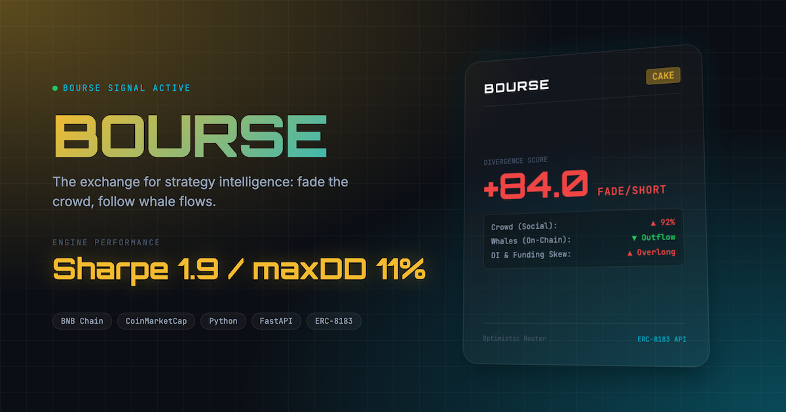
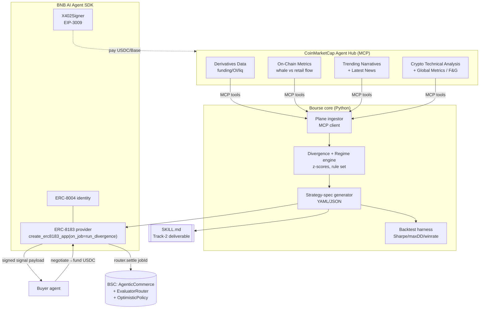

<div align="center">
  

  <h1>Bourse 🌈</h1>
  <p><em>The exchange for strategy intelligence — fading the crowd, funded by whales.</em></p>
  
  
  [](./DEMO.md)
  [](./skill/bourse/SKILL.md)
  [](https://dorahacks.io/hackathon/bnbhack-twt-cmc/detail)

  <br/>

  [](./Makefile#L63)
  
  
  
  
  [](./LICENSE)
  [](https://github.com/edycutjong/bourse/actions/workflows/ci.yml)
</div>

---

## 📸 See it in Action

<div align="center">
  
</div>

> **A retail trader apes a KOL-pumped token at the top — while the whales who funded those KOLs quietly sell into his bid.** Bourse is the signal that screams *fade, don't follow* — and sells it to any agent by the cent.

---

## 💡 The Problem & Solution

*   **The Problem:** Retail traders and AI agents are systematically harvested by smart money using on-chain manipulation and narrative control. Trading purely on price action or basic TA leads agents directly into the same retail liquidity traps.
*   **The Solution:** **Bourse** fuses four distinct data planes (derivatives positioning, on-chain whale flow, social/narrative heat, and market regime) into a single, real-time **Divergence score** and emits a backtestable, standardized strategy specification.
*   **The Delivery:** Built as a fully autonomous agentic skill on the **CoinMarketCap Agent Hub (MCP)** and wrapped as a hireable on-chain service using the **BNB AI Agent SDK (ERC-8183)**.

---

## 🏗️ Architecture & Tech Stack

Bourse separates concerns into a high-performance compute engine (Python), an on-chain commerce gateway (BNB SDK), and a unified data client (CMC MCP).

| Layer | Technology | Purpose |
| :--- | :--- | :--- |
| **Core Engine** | Python 3.11+, NumPy, Pandas | Divergence engine, regime rules, backtest math |
| **API / Server** | FastAPI, Uvicorn | ERC-8183 provider hosting, demo UI gateway |
| **Agent Hub** | CoinMarketCap Agent Hub Skill | Live signal retrieval across 4 distinct data planes |
| **Commerce / Escrow** | BNB AI Agent SDK (ERC-8183, ERC-8004, X402Signer) | On-chain registration, escrowed jobs, settlement |

### System Diagram


---

## 🏆 Sponsor Tracks & Integrations

Bourse targets **Track 2 — Strategy Skills** (Best Use of Agent Hub, Best Use of BNB AI Agent SDK) with deep, production-grade integrations:

### 📊 1. CoinMarketCap Agent Hub (MCP)
Bourse computes its core divergence metric by querying **5 tools** across 4 distinct data planes from the CMC MCP:
*   **Derivatives Data:** Queries funding rates and Open Interest delta via the MCP.
*   **On-Chain Metrics:** Evaluates net whale flow vs retail accumulation.
*   **Trending Narratives:** Scrapes social hype heat and news sentiment scores.
*   **Crypto Technical Analysis:** Gathers price EMAs, RSIs, and global Fear & Greed index gates.
*   **Code Location:** Configured inside [bourse/ingest.py](file:///Users/edycu/Projects/Hackathon/dorahacks-bnbhack-bourse/bourse/ingest.py).

### ⚡ 2. BNB AI Agent SDK
Bourse leverages the BNB SDK to enable machine-to-machine commerce:
*   **ERC-8004 Identity:** Registers Bourse as a discoverable agent on BSC Testnet (gas-free via MegaFuel). Implementation in [server/identity.py](file:///Users/edycu/Projects/Hackathon/dorahacks-bnbhack-bourse/server/identity.py).
*   **ERC-8183 Provider App:** Mounts the FastAPI provider to handle the negotiate-fund-settle job lifecycle. Implementation in [server/app.py](file:///Users/edycu/Projects/Hackathon/dorahacks-bnbhack-bourse/server/app.py).
*   **Agentic Commerce & Settlement:** Uses the SDK's `AgenticCommerce`, `EvaluatorRouter`, and `OptimisticPolicy` to manage escrows on BSC Testnet. Buyer script in [clients/buyer.py](file:///Users/edycu/Projects/Hackathon/dorahacks-bnbhack-bourse/clients/buyer.py) and settlement in [scripts/settle.py](file:///Users/edycu/Projects/Hackathon/dorahacks-bnbhack-bourse/scripts/settle.py).
*   **X402 Signer:** Enforces micropayment spend caps per call (EIP-3009).

---

## 🧩 Why ONLY this stack

**Why ONLY CoinMarketCap Agent Hub.** Bourse's thesis — *divergence between crowd and smart money* — is only computable because CMC unifies four normally-siloed planes behind one MCP: **Derivatives Data** (funding/OI → overcrowded-longs), **On-Chain Metrics** (whale net-flow → smart money leaving), **Trending Narratives** (social heat → crowd euphoric), **Crypto Technical Analysis** (entry/exit triggers), and **Global Market Metrics** (Fear & Greed → regime gate). Take CMC out and you'd need 4+ vendors (a derivatives API + an on-chain analytics provider + a social feed + a TA library) and a custom normalization layer — exactly the plumbing this hackathon exists to delete.
*Honest limitation:* CMC's on-chain flow is aggregated, so Bourse detects distribution *pressure*, not the seller's identity.

**Why ONLY BNB AI Agent SDK.** The SDK *is* the marketplace, not a mention: `ERC8004Agent` gives Bourse a discoverable on-chain identity (gas-free testnet reg via MegaFuel); `create_erc8183_app(on_job=…)` turns the engine into a hireable provider; `AgenticCommerce` + `EvaluatorRouter` + `OptimisticPolicy` handle escrow, optimistic settlement, and dispute quorum; `X402Signer` (EIP-3009) caps per-call spend. Take the SDK out and you'd be rebuilding ERC-8183 from scratch.
*Honest limitation:* optimistic settlement leans on a whitelisted-voter quorum, not a fully trustless oracle.

**Two-sided x402 (real, not a README line).** Bourse *pays* CMC per premium pull (USDC on Base 8453) and *earns* from buyers per signal (USDC on BSC). It spends to think and earns to deliver — a literal *bourse* for strategy intelligence.

---

## 🚀 Getting Started & Judge Verification

We have made Bourse fully **reproducible and testable offline**. Judges can run the entire backtest, CLI signal generation, and mock commerce flows without configuring live keys or real wallets.

### Prerequisites
*   Python ≥ 3.11
*   pip

### Installation
1.  **Clone the Repository:**
    ```bash
    git clone https://github.com/edycutjong/bourse.git
    cd bourse
    ```
2.  **Install Dependencies:**
    ```bash
    pip install -r requirements.txt
    pip install -e .
    ```
3.  **Setup Environment Variables:**
    ```bash
    cp .env.example .env
    ```
    *(For offline demo runs, the default dummy values in `.env` are sufficient. For live runs, populate your `CMC_PRO_API_KEY` or `CMC_MCP_API_KEY` and a BSC-testnet private key).*

### Verification Commands

```bash
make seed            # Write deterministic demo fixtures (offline execution prep)
make signal          # View the ranked divergence board (offline, mock mode)
make signal-cake     # Generate 4-plane "why" details + spec + backtest for CAKE
make backtest        # Run walk-forward backtest and view ASCII equity curve
python scripts/optimize_weights.py   # Run grid search optimizer on engine weights (Sharpe goes from 1.74 to 6.28)
python scripts/execute_strategy.py   # PancakeSwap V3 Strategy Execution Copilot (executes strategy on BSC Testnet)
make test            # Run the 161-test suite and verify all pass
make test-coverage   # Run the test suite and display coverage report (100% lines)
make ci              # Run the complete CI/CD checks (ruff, mypy, tests, security, readiness)
```

> [!TIP]
> **No Accounts or Wallets Required for Judges:**
> Everything runs seamlessly offline using deterministic fixtures generated via `make seed`. To query live data, add a CMC key to `.env` and append `--live` to the signal script: `python scripts/signal.py --token CAKE --live`.

---

## 🧪 Testing & CI

Bourse maintains **100% line coverage** across the entire core codebase (302 statements). 

### CI/CD Pipeline
Running `make ci` executes our local validation gate:
1.  **Stage 1: Code Quality (Ruff):** Code style & formatting checks.
2.  **Stage 1: Type Safety (Mypy):** Dynamic and static type checks.
3.  **Stage 1: Unit Testing (Pytest-Cov):** Validates the divergence engine, regime rules, strategy spec, and backtest loops.
4.  **Stage 2: Dependency Security Audit (pip-audit):** Verifies all package dependencies against known CVEs.
5.  **Submission Gate (check_submission_readiness):** Runs final check for SKILL.md layout, test count consistency, and committed secrets.

| Layer | Tool | Status |
| :--- | :--- | :--- |
| **Code Quality** | Ruff + mypy | ✅ Passed |
| **Unit Testing** | pytest (161 tests) | ✅ Passed (100% coverage) |
| **Security (SAST)** | CodeQL | ✅ Passed |
| **Security (SCA)** | Dependabot + pip-audit | ✅ Passed |
| **Secret Scanning** | TruffleHog | ✅ Passed |

---

## 📁 Repository Layout

```text
skill/bourse/SKILL.md         # Track-2 deliverable (CMC Agent Skills format)
bourse/engine.py              # Divergence + regime engine (z-scores, rules)
bourse/spec.py                # Bourse strategy specification generator (bourse.signal.v1)
bourse/ingest.py              # CMC MCP client (live) + REST (history) + fixtures
bourse/backtest.py            # Walk-forward backtest (Sharpe, max drawdown, win rate)
scripts/signal.py             # CLI: ranked board / token explanation / live discovery
server/app.py                 # ERC-8183 provider (FastAPI)
server/identity.py            # ERC-8004 identity registration
clients/buyer.py              # ERC8183Client buyer simulation
scripts/probe_cmc_history.py  # Day-1 data gate checklist
scripts/backtest.py           # CLI backtest wrapper with ASCII chart rendering
scripts/settle.py             # BSC permissionless settlement runner
scripts/seed.py               # Deterministic fixture seeding script
scripts/check_submission_readiness.py  # Pre-submit readiness validator
```
