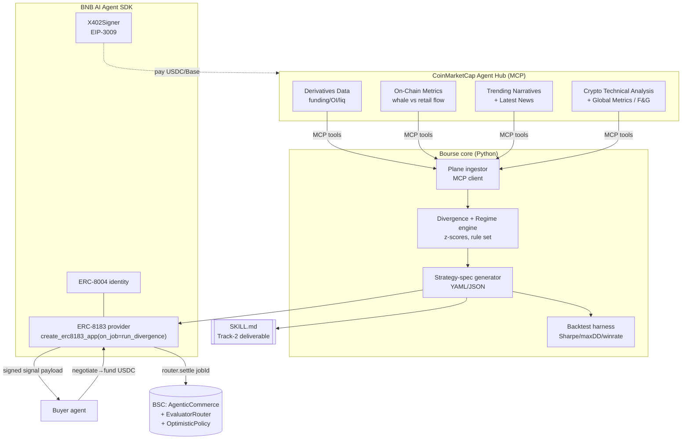

# Architecture — Bourse

> Grounded in the verified surfaces in `docs/SPONSOR_DOCS.md`. Every API name below is confirmed real.

## Tech stack (optimized for solo, 3 weeks)
| Layer | Choice | Why |
|---|---|---|
| Language | **Python 3.11** | bnbagent-sdk is Python; CMC MCP + numpy backtest in one runtime |
| Agent/commerce | **`bnbagent-sdk`** (`pip install bnbagent[server]`) | ERC-8004 identity + ERC-8183 provider + x402 signer, all verified |
| Server | **FastAPI + Uvicorn** | `create_erc8183_app()` mounts here; also serves thin demo UI |
| Data | **CMC MCP** (`https://mcp.coinmarketcap.com/mcp`, `X-CMC-MCP-API-KEY`) + `cmc-x402` for premium pulls | 12 tools, 4 planes |
| Compute | **numpy** | z-scores, regime rules, walk-forward backtest + optimizer — rule-based, legible |
| Skill | **`SKILL.md`** (Anthropic Agent Skills fmt) in `skill/bourse/` | Track-2 deliverable, Marketplace-submittable |
| Chains | **BSC** (ERC-8183 escrow/settlement) + **Base 8453** (CMC x402/USDC) | per verified docs |
| Demo UI | **single `landing/index.html`** (static, Vercel) | thin — judges grade the Skill, not the UI |
| Tests | **pytest** | target ≥100; divergence math + spec + ERC-8183 paths |

## System diagram


## The divergence/regime engine (core IP)
Per token, normalize each plane to a rolling z-score, then combine:
- **Crowd score** = w1·z(Trending-Narratives heat) + w2·z(social/news volume)
- **Smart-money score** = w3·z(On-Chain net whale flow) + w4·z(funding/OI skew from Derivatives Data)
- **Divergence** = `crowd − smartmoney` ∈ [−100,+100]. High +ve & crowd-hot/flow-out → **FADE/SHORT**; high −ve & crowd-cold/flow-in → **ACCUMULATE/LONG**.
- **Regime** classifier (rule table) from F&G + funding direction + OI delta + technicals → {risk-on, risk-off, accumulation, distribution, chop}. Regime gates position sizing.
- Weights `w1..w4` are config, not learned (legible for judges; tunable in backtest).

## Strategy-spec output (deterministic, backtestable)
```yaml
schema: bourse.signal.v1
generated_at: 2026-06-21T00:00:00Z
token: CAKE
regime: distribution
divergence: +84            # crowd hot, smart money leaving
direction: short
entry: { trigger: "price < ema(20) AND funding > p90" }
exit:  { take_profit: "divergence < +20", time_stop_h: 48 }
stop:  { type: atr, mult: 1.5 }
sizing: { pct_portfolio: 3, regime_scalar: 0.5 }
invalidation: "on-chain whale flow flips net-inflow"
sources: [DerivativesData, OnChainMetrics, TrendingNarratives, GlobalMetrics]
backtest: { sharpe: 1.9, max_dd: 0.11, win_rate: 0.58, n: 90d }
```

## ERC-8183 service surface (Best Use of BNB SDK)
- **Identity:** `ERC8004Agent(network="bsc-...", wallet_provider=EVMWalletProvider(...))` → register (gas-free testnet via MegaFuel).
- **Provider:** `create_erc8183_app(on_job=run_divergence)` mounted at `/erc8183`; routes `/negotiate`, `/status`, `/job/{id}`. `ERC8183_SERVICE_PRICE` set; jobs under price auto-reject HTTP 402.
- **Deliverable:** `on_job` runs the engine for the requested basket, returns the `bourse.signal.v1` payload; SDK uploads to storage + submits on-chain hash.
- **Settlement:** permissionless `router.settle(jobId)` after dispute window (`OptimisticPolicy`); operator script in `scripts/settle.py`.
- **Buyer demo:** `ERC8183Client` script: negotiate → fund USDC → poll FUNDED → receive payload → settle. Prints BSC tx hashes.

## CMC MCP tools used (Agent Hub depth — ≥5 across 4 planes)
`Derivatives Data` · `On-Chain Metrics` · `Trending Narratives` · `Crypto Technical Analysis` · `Global Market Metrics` (+ `Latest News`, `Live Quotes` supporting). x402 path via `cmc-x402` for premium/per-request pulls inside the job loop.

## Repo layout
```
bourse/
  skill/bourse/SKILL.md          # Track-2 deliverable (Agent Skills format)
  bourse/ingest.py               # CMC MCP client (4 planes)
  bourse/engine.py               # divergence + regime (z-scores, rules)
  bourse/spec.py                 # strategy-spec generator (bourse.signal.v1)
  bourse/backtest.py             # numpy walk-forward backtest -> Sharpe/maxDD/winrate
  server/app.py                  # FastAPI + create_erc8183_app(on_job=...)
  server/identity.py             # ERC-8004 registration
  clients/buyer.py               # ERC8183Client demo (negotiate->settle)
  scripts/bench.py settle.py seed.py check_submission_readiness.py
  data/fixtures/                 # deterministic historical slices
  landing/index.html             # thin demo page (Vercel)
  tests/                         # pytest, >=100
```

## Risks & mitigations
- **🚩 #1 CMC historical depth for backtest (GO/NO-GO — verify Day 1).** Track 2's deliverable MUST be backtestable, but CMC MCP tools are mostly *latest-snapshot*. Before committing, confirm what history is reachable on the hackathon CMC tier (price OHLCV history via Pro REST is likely; historical *funding/social/on-chain* may not be). Fallbacks in priority order: (a) use CMC historical REST where it exists; (b) **forward-collect** signals into `data/fixtures/` from Day 1 so a real 2-week backtest window exists by submission; (c) if a plane has no history, backtest the *price+available* legs and present the missing-plane legs as live-only signals (documented honestly). The full 4-plane divergence still computes live for the demo regardless.
- **🚩 #2 Per-token data coverage.** Bourse's 4-plane divergence only fires on tokens with full coverage. Many of the 149 eligible BEP-20s (GUA, SMILEK, DUCKY, etc.) lack derivatives/social data. **Bourse operates on the liquid subset (~top 20–30 of the 149) with complete plane coverage;** the board greys out under-covered tokens rather than emitting low-confidence noise. Demo token CAKE has full coverage.
- **ERC-8183 mainnet vs testnet** → demo on BSC testnet (gas-free reg); attempt one mainnet job for "real transactions" credibility if funds allow.
- **CMC x402 is on Base, ERC-8183 escrow on BSC** → two-chain story; keep them clearly separated in the demo (Bourse *pays* on Base, *gets paid* on BSC) — this is a feature (dual x402 usage), not a bug.
- **Scope creep** → engine weights stay rule-based; no ML; no execution.
